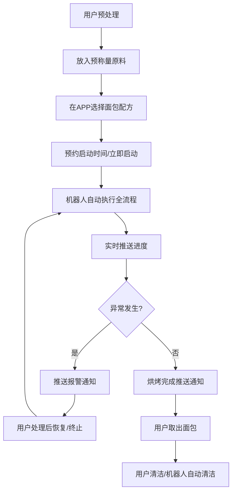

# 基于LeRobot平台的自动做面包家务机器人 MVP PRD

## 1. 产品概述

### 1.1 产品定位
一款基于LeRobot开源机器人平台开发的家用全自动面包制作机器人，能够完成从原料准备到烘焙完成的全流程自动化操作，解放用户双手，享受新鲜烘焙的家常面包。

### 1.2 目标用户
- 面包烘焙爱好者，但没有足够时间完成全程操作
- 上班族，希望早上起床就能吃到新鲜出炉的面包
- 家庭用户，追求健康无添加的自制面包

### 1.3 MVP核心目标
验证基于LeRobot平台实现家用面包自动化制作的技术可行性，完成核心流程的自动化演示。

---

## 2. LeRobot平台能力对齐

### 2.1 LeRobot平台原生支持能力

| 能力类别 | 功能描述 | LeRobot支持情况 |
|---------|---------|---------------|
| **机械臂控制** | 6自由度运动控制、路径规划 | ✅ 原生支持（通过so100等开源机械臂配置） |
| **视觉识别** | 物体检测、目标定位 | ✅ 原生支持（集成了SOTA视觉模型） |
| **末端执行器** | 夹爪抓取操作 | ✅ 原生支持（标准夹爪） |
| **力控反馈** | 接触力检测和控制 | ✅ 部分支持（平台框架支持，需硬件适配） |
| **示教复刻** | 人工示教后复现动作 | ✅ 原生支持（LeRobot核心特性） |
| **任务编排** | 多任务序列调度 | ✅ 原生支持（数据集和策略框架） |
| **GPU加速** | 本地/云端推理加速 | ✅ 支持CUDA |

### 2.2 需要定制改造的功能

| 功能类别 | 需求描述 | 改造难度 | 说明 |
|---------|---------|---------|-----|
| **温度传感集成** | 烤箱温度实时监测 | ⭐⭐ 中等 | 需要扩展IO接口，接入温度传感器 |
| **原料称重模块** | 面粉/水/酵母自动称量 | ⭐⭐⭐ 高 需要定制末端+称重复合结构 | 需要定制称量工具或集成电子秤接口 |
| **面团揉制机构** | 模拟揉面的挤压折叠动作 | ⭐⭐⭐ 高 需要特殊末端执行器 现有夹爪无法完成揉面，需要改造揉面勾末端 |
| **烤箱门操作** | 开关烤箱门的力控适配 | ⭐⭐ 中等 需要调整力控参数，避免门弹开失控 |
| **防污染设计** | 食品接触材料更换 | ⭐⭐ 中等 所有接触食品的部件需要符合食品安全标准 机械臂末端需要可拆卸清洗设计 |
| **安全防护** | 温度防护、碰撞检测 | ⭐⭐ 中等 需要添加温度传感器和急停机制 |

---

## 3. 产品功能定义

### 3.1 功能框图

```
┌─────────────────────────────────────────────────────────────┐
│                        用户交互层                              │
│  ┌──────────┐  ┌──────────┐  ┌──────────┐  ┌──────────┐    │
│  │ APP预约  │  │ 启动/暂停 │  │ 进度查看 │  │ 异常报警 │    │
│  └──────────┘  └──────────┘  └──────────┘  └──────────┘    │
└─────────────────────────────────────────────────────────────┘
                              ↓
┌─────────────────────────────────────────────────────────────┐
│                       任务调度层                              │
│  ┌──────────────┐ ┌──────────────┐ ┌──────────────┐         │
│  │ 流程编排引擎 │ │ 状态机管理   │ │ 异常处理模块│         │
│  └──────────────┘ └──────────────┘ └──────────────┘         │
└─────────────────────────────────────────────────────────────┘
                              ↓
┌─────────────────────────────────────────────────────────────┐
│                       执行控制层                              │
│  ┌──────────┐  ┌──────────┐  ┌──────────┐  ┌──────────┐    │
│  │机械臂控制│  │视觉定位  │  │力反馈控制│  │传感器IO │    │
│  └──────────┘  └──────────┘  └──────────┘  └──────────┘    │
└─────────────────────────────────────────────────────────────┘
                              ↓
┌─────────────────────────────────────────────────────────────┐
│                     硬件物理层                                │
│  ┌────────────┐ ┌────────────┐ ┌────────────┐ ┌──────────┐ │
│  │LeRobot机械臂│ │ 定制末端器 │ │ 传感模块   │ │ 家用烤箱 │ │
│  └────────────┘ └────────────┘ └────────────┘ └──────────┘ │
│  ┌────────────┐ ┌────────────┐ ┌────────────┐              │
│  │ 原料容器   │ │ 称量模块   │ │ 揉面盆     │              │
│  └────────────┘ └────────────┘ └────────────┘              │
└─────────────────────────────────────────────────────────────┘
```

### 3.2 核心功能列表

#### 3.2.1 MVP版本核心功能
1. **原料准备自动化**
   - 从存储位置取用面粉、水、酵母、盐等原料
   - 按配方比例称量（基础版本用户预先称量好，机器人仅取用）

2. **和面揉面**
   - 将原料倒入揉面盆
   - 完成基础揉面动作（需要定制揉面勾）
   - 一次发酵等待过程控制

3. **整形入篮**
   - 将揉好的面团整形放入发酵篮
   - 二次发酵等待

4. **烘烤流程**
   - 打开烤箱门
   - 将面团移入烤箱
   - 设定烘烤时间温度
   - 烘烤完成后取出面包

5. **安全监控**
   - 温度异常报警
   - 机械碰撞停止
   - 紧急停止按钮

#### 3.2.2 后续版本扩展功能
- 多种配方存储和选择
- 面团发酵状态视觉检测
- 自动清洗揉面工具
- 成品评分反馈
- 与智能家居集成

---

## 4. 交互设计

### 4.1 用户交互流程



### 4.2 状态机设计

| 状态 | 触发条件 | 下一个状态 |
|-----|---------|-----------|
| IDLE（待机） | 用户启动指令 | PREP_RAW（原料准备） |
| PREP_RAW | 原料投放完成 | KNEAD（揉面） |
| KNEAD | 揉面完成 | FERMENT_1（一次发酵） |
| FERMENT_1 | 发酵时间到 | SHAPE（整形） |
| SHAPE | 整形完成 | FERMENT_2（二次发酵） |
| FERMENT_2 | 二次发酵完成 | PRE_BAKE（烤箱预热） |
| PRE_BAKE | 预热完成 | BAKE（烘烤） |
| BAKE | 烘烤完成 | COOL（冷却） |
| COOL | 冷却完成 | DONE（完成） |
| ANY | 异常/急停 | ERROR（错误） |
| ERROR | 用户处理恢复 | 原状态 |
| ERROR | 用户终止 | IDLE |

---

## 5. 任务模块拆解

完整面包制作流程拆解为以下可执行机器人任务模块：

### 5.1 模块1：原料准备阶段

| 子任务编号 | 任务描述 | 动作要求 | 依赖 |
|-----------|---------|---------|------|
| 1.1 | 视觉定位各原料容器位置 | 识别面粉罐、水瓶、酵母盒、盐罐位置 | - |
| 1.2 | 夹取面粉容器，倾倒面粉到揉面盆 | 控制倾倒角度和速度，避免撒出 | 1.1 |
| 1.3 | 夹取水容器，按重量加水到揉面盆 | 控制流速，称量到位即停止 | 1.2 |
| 1.4 | 添加酵母和盐 | 分别添加到指定位置，避免直接混合 | 1.3 |

*MVP简化方案：用户预先将所有原料称量好放入分装容器，机器人仅执行倾倒混合*

### 5.2 模块2：揉面阶段

| 子任务编号 | 任务描述 | 动作要求 | 依赖 |
|-----------|---------|---------|------|
| 2.1 | 初步混合粉料和水 | 用揉面勾搅拌混合干湿原料 | 1.4 |
| 2.2 | 反复折叠揉压面团 | 按照"折叠-按压-旋转"周期重复动作 | 2.1 |
| 2.3 | 揉面完成检测（视觉/时间） | 判断面团是否达到光滑程度 | 2.2 |
| 2.4 | 整理面团成球 | 将面团收拢成团放入发酵盆 | 2.3 |

### 5.3 模块3：第一次发酵

| 子任务编号 | 任务描述 | 动作要求 | 依赖 |
|-----------|---------|---------|------|
| 3.1 | 将发酵盆移动到保温发酵位置 | 平稳移动避免面团变形 | 2.4 |
| 3.2 | 启动计时等待 | 根据配方设定等待1-1.5小时 | 3.1 |
| 3.3 （可选） | 发酵程度视觉检测 | 判断面团体积膨胀是否到位 | 3.2 |

### 5.4 模块4：整形

| 子任务编号 | 任务描述 | 动作要求 | 依赖 |
|-----------|---------|---------|------|
| 4.1 | 排气 | 按压面团排出大气泡 | 3.2 |
| 4.2 | 滚圆成型 | 将面团整形为圆形/长方形 | 4.1 |
| 4.3 | 放入发酵篮/烤盘 | 转移面团到发酵容器中 | 4.2 |

### 5.5 模块5：第二次发酵

| 子任务编号 | 任务描述 | 动作要求 | 依赖 |
|-----------|---------|---------|------|
| 5.1 | 将发酵篮移动到发酵位置 | 平稳移动 | 4.3 |
| 5.2 | 计时等待 | 等待30-60分钟 | 5.1 |
| 5.3 | 发酵完成检查 | 确认发酵到位 | 5.2 |

### 5.6 模块6：烘烤

| 子任务编号 | 任务描述 | 动作要求 | 依赖 |
|-----------|---------|---------|------|
| 6.1 | 检测烤箱门关闭状态 | 视觉确认 | 5.3 |
| 6.2 | 启动烤箱预热 | 发送预热指令（智能烤箱）或提醒用户提前预热 | 6.1 |
| 6.3 | 达到预定温度后机械臂开门 | 力控缓慢拉开烤箱门 | 6.2 |
| 6.4 | 将面团/烤盘放入烤箱指定位置 | 准确放置 | 6.3 |
| 6.5 | 关闭烤箱门 | 缓慢关门到位 | 6.4 |
| 6.6 | 启动烘烤计时 | 根据配方设定时间 | 6.5 |
| 6.7 | 烘烤完成后开门 | 温度下降后开门避免大量热气喷出 | 6.6 |
| 6.8 | 取出面包放到冷却架 | 夹取烤盘平稳移出 | 6.7 |
| 6.9 | 关闭烤箱门 | 关闭烤箱电源 | 6.8 |

### 5.7 模块7：完成冷却

| 子任务编号 | 任务描述 | 动作要求 | 依赖 |
|-----------|---------|---------|------|
| 7.1 | 计时冷却 | 等待15-30分钟 | 6.9 |
| 7.2 | 通知用户取出成品 | 发送完成提醒 | 7.1 |

---

## 6. 系统架构

### 6.1 硬件架构

```
┌───────────────────────────────────────────────────────────┐
│                     LeRobot so100 机械臂                    │
│  6自由度 + 标准夹爪（替换为定制揉面勾/烤盘夹爪）            │
└──────────────────────────────────┬──────────────────────────┘
                                   │
┌──────────────────────────────────▼──────────────────────────┐
│                         控制计算单元                          │
│  树莓派 / Jetson Orin 运行LeRobot软件栈                      │
└──────────────────────────────────┬──────────────────────────┘
                                   │
        ┌──────────────────┬───────┼────────┬───────────┐
        │                  │       │        │           │
    ┌───────┐          ┌───────┐  │     ┌───────┐   ┌───────┐
    │ 视觉  │          │温度   │  │     │称重   │   │ 急停  │
    │相机   │          │传感器│  │     │传感器│   │按钮   │
    └───────┘          └───────┘  │     └───────┘   └───────┘
                                   │
        ┌───────────────────────────────────────────────────┐
        │                工作站区域布局                        │
        │  ┌──────────┐ ┌──────────┐ ┌──────────┐          │
        │  │原料区    │ │揉面区    │ │发酵区    │          │
        │  └──────────┘ └──────────┘ └──────────┘          │
        │  ┌──────────┐ ┌──────────┐ ┌──────────┐          │
        │  │冷却架    │ │烤箱      │ │清洁槽    │          │
        │  └──────────┘ └──────────┘ └──────────┘          │
        └───────────────────────────────────────────────────┘
```

### 6.2 软件架构

- **底层：** LeRobot官方框架提供机械臂控制、视觉识别、策略学习
- **中间层：** 任务编排引擎，基于状态机调度各子任务
- **应用层：** Web/APP交互界面，配方管理、进度监控

---

## 7. MVP版本Roadmap

### 7.1 阶段划分

| 阶段 | 时间预估 | 目标 | 交付物 |
|-----|---------|------|-------|
| **Phase 1: 平台适配** | 1-2周 | LeRobot硬件环境搭建，完成基础动作调试 | 可用LeRobot控制机械臂完成基本抓取移动 |
| **Phase 2: 定制末端开发** | 2-3周 | 设计制作可更换末端（揉面勾+烤盘夹爪），食品接触材料验证 | 3D打印/加工完成定制末端，完成安装调试 |
| **Phase 3: 任务模块开发** | 3-4周 | 逐个开发调试任务模块，示教录制动作序列 | 各子任务可单独成功执行 |
| **Phase 4: 全流程集成** | 2周 | 集成所有模块，调试异常处理，完成完整面包制作跑通 | 全流程自动化运行成功，产出可食用面包 |
| **Phase 5: 测试优化** | 1-2周 | 多次反复测试，优化动作精度和可靠性，收集数据 | MVP稳定性报告，问题清单 |

总计：**9-13周**

### 7.2 MVP功能范围边界

#### 包含
- [x] LeRobot原生机械臂运动控制
- [x] 计算机视觉定位物料位置
- [x] 完整流程任务编排
- [x] 定制揉面和烤盘夹爪末端
- [x] 温度传感器监控烤箱
- [x] 基础安全防护（急停、碰撞检测）
- [x] 手机APP查看进度

#### 不包含（后续版本）
- [ ] 全自动称量（MVP用户预处理称量）
- [ ] 发酵程度AI检测（MVP基于时间）
- [ ] 自动清洁
- [ ] 多配方切换（MVP支持单配方）
- [ ] 非球形面包整形（MVP基础整形）

---

## 8. 风险分析与应对

| 风险 | 影响程度 | 发生概率 | 应对方案 |
|-----|---------|---------|---------|
| 现有机械臂负载不足完成揉面 | 高 | 中 | 优化揉面动作策略，降低瞬时负载；考虑增加辅助揉面固定机构 |
| 食品接触安全合规 | 中 | 高 | 所有接触部件使用食品级3D打印材料或不锈钢，设计可拆卸方便清洗消毒 |
| 烤箱门开关力控不稳定 | 中 | 中 | 多次示教学习不同力度，增加力控阈值保护 |
| 面团粘黏无法抓取 | 高 | 中 | 使用不粘涂层工具，设计合适的抓取策略，避免直接接触面团 |
| 温度过高对电子器件影响 | 中 | 低 | 机械臂工作区域远离烤箱高温区，增加隔热防护 |

---

## 9. 验收标准

MVP版本成功验收标准：

1. ✅ 机械臂能够基于LeRobot平台正常完成所有规划动作序列
2. ✅ 从原料投放开始到面包烘烤完成，全流程自动化执行无需人工干预
3. ✅ 最终产出可食用、外观正常的成品面包
4. ✅ 安全机制正常工作，异常情况下能够急停报警
5. ✅ 连续三次成功运行无故障
